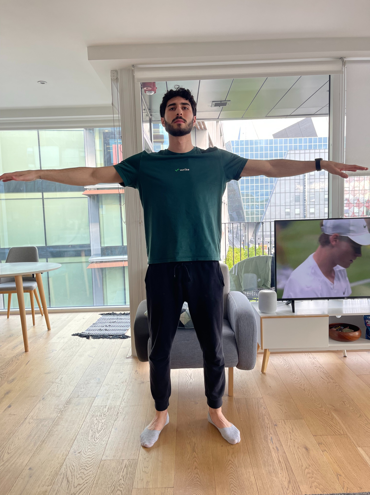
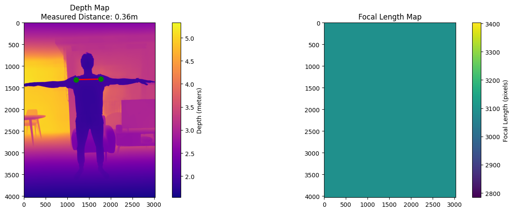
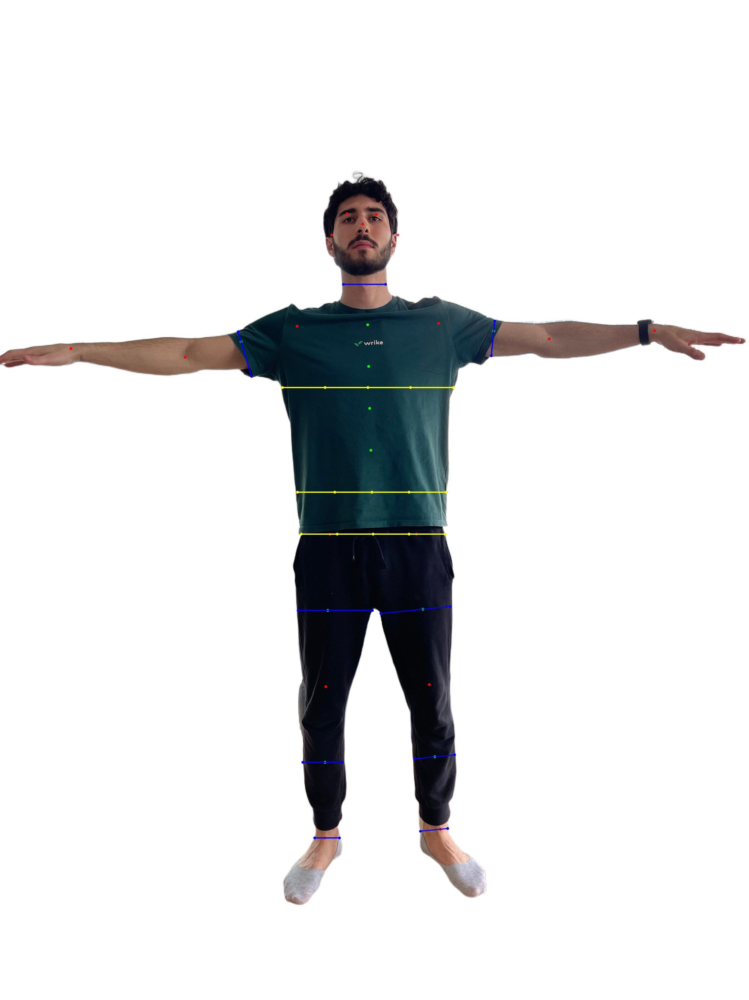
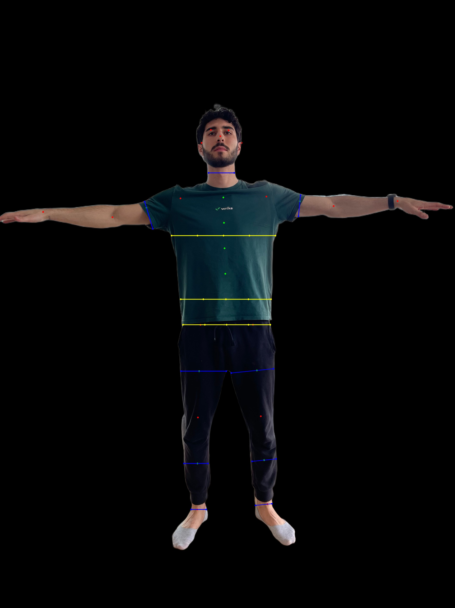

# AI-Powered Clothing Fit Finder for Shopify

This project helps users find well-fitting clothes on Shopify using artificial intelligence. With just a single front-facing photo, the system extracts precise body measurements and suggests clothes that match the user's real body size. The application uses computer vision to analyze a user's body shape and provide personalized clothing recommendations. It seamlessly integrates with Shopify to enhance the online shopping experience.

## 📷 App Preview

### 1. Upload Photo Screen


### 2. Body Measurement Detection





## ✨ Key Features

- 📸 **Photo-Based Measurement**: Users simply upload one clear front photo in well-fitting clothes.
- 📏 **AI Body Measurement**: The system automatically detects key body points and estimates measurements like waist, hips, and arms.
- 🛍️ **Smart Shopify Integration**: Measurements are sent to Shopify, where size-matched clothing is recommended.
- 💡 **No Extra Hardware**: No need for special cameras or equipment—just one photo is enough.

## 🚀 How It Works

1. User uploads a front-facing photo.
2. AI model processes the image to extract key body measurements.
3. Measurements are sent to Shopify through the app's backend.
4. Shopify displays recommended clothing items that match the measurements.

## 🔧 Tech Stack

- **Frontend**: Flutter (or specify if you used web/React/Next.js)
- **Backend**: Python (FastAPI / Flask)
- **Computer Vision**: OpenCV, Mediapipe, or custom model
- **Integration**: Shopify API

## 📂 Project Structure

```bash
├── frontend/                 # Mobile/web UI
├── backend/                  # API and CV logic
├── models/                   # AI/ML models for measurement
├── images/                   # Images for README
└── README.md
